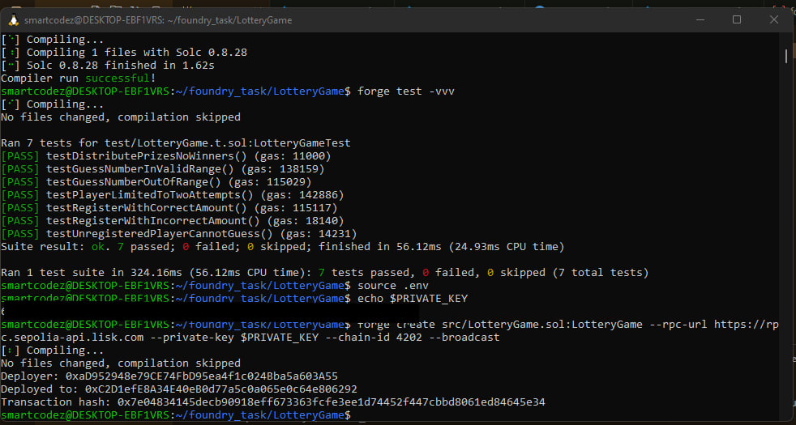

# 🎲 LotteryGame

[](LICENSE)
[](https://getfoundry.sh/)
[](https://soliditylang.org/)

---

A simple Ethereum lottery game where players stake ETH, guess a number, and win prizes.  
Built with Solidity, Foundry, and ❤️.

---

## 📂 Project Structure

LotteryGame/ ├── src/ │ └── LotteryGame.sol # Main contract ├── test/ │ └── LotteryGame.t.sol # Tests ├── script/ │ └── LotteryGame.s.sol # Deployment script ├── lib/ │ └── forge-std/ # Forge standard library ├── foundry.toml # Project config └── README.md


---

## ⚙️ Requirements

- [Foundry](https://book.getfoundry.sh/)
- Solidity 0.8.17 or higher
- (Optional) Node.js, Anvil, Metamask

---

## 🛠 How to Build and Test

**Build the contracts:**
```bash
forge build
```

## Run all tests:
```bash
forge test -vvv
```
* -vvv gives detailed debug traces.

## 🧩 How the Game Works

Players must stake exactly 0.02 ETH to register.

Each player gets up to 2 guesses.

Guess a number between 1 and 9.

Correct guessers are added to the winners list.

After all guesses, prizes are distributed equally among winners.

After prize distribution, the game resets for a new round.

You can view previous winners.


## 🚀 Deployment (Optional)
```bash
forge script script/LotteryGame.s.sol --fork-url http://localhost:8545 --broadcast
```
Replace localhost with your testnet RPC if needed.




## ⚠️ Important Notes

The randomness uses block variables (timestamp, prevrandao) — not secure for production.

For production apps, consider using Chainlink VRF for verifiable randomness.

Validate all assumptions about gas usage, replay protection, and security if upgrading for mainnet.


## 📜 License
This project is licensed under the MIT License.

## 🙌 Acknowledgements

Built with Foundry

Created by SmartCodez ✨

Inspired by Solidity & blockchain learning projects.

